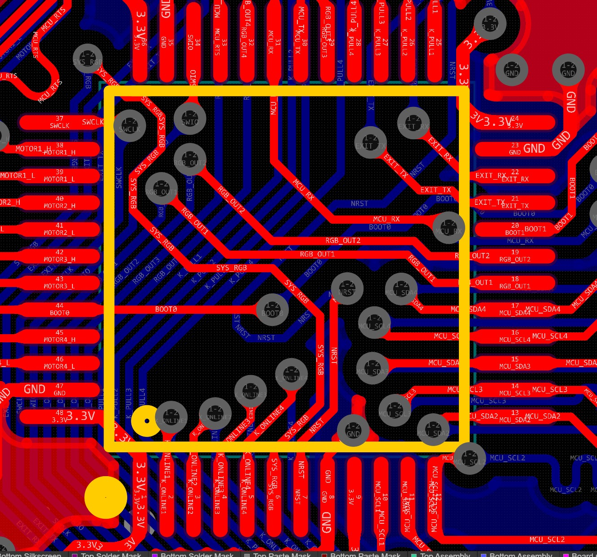
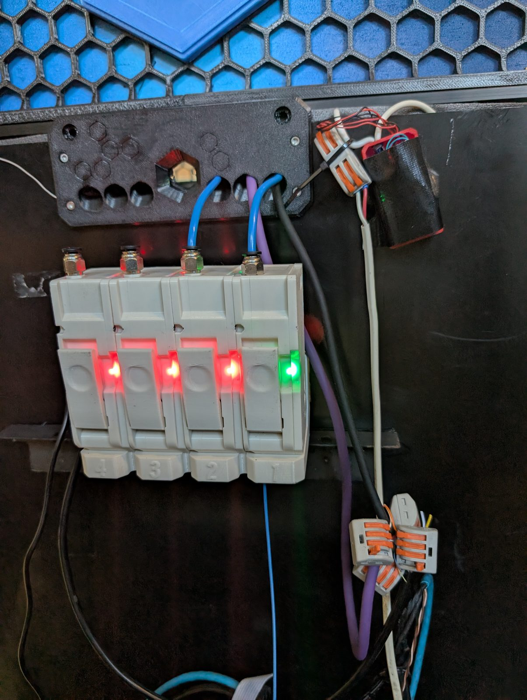

# Firmware Flashing

The BMCU libre firmware is built from source using PlatformIO.

This repo does not vendor the upstream firmware — it is a pinned git submodule, assembled with our patch set at build time. **Clone with submodules before building:**

```bash
git submodule update --init --recursive
```

That populates both `firmware/upstream/` (the BMCU firmware) and `tools/bmcu-flasher/` (the flashing tool). Without it, the commands below fail with missing files.

Pre-built *upstream* firmware variants — the BambuBus builds, not the libre build — are in `firmware/upstream/firmwares/` once the submodule is initialised. The libre build must be compiled from source.

## Option A: bmcu-flasher (recommended)

The `bmcu-flasher` tool is a submodule at `tools/bmcu-flasher/`. It handles automatic bootloader entry on Type-C mainboards (AutoDI) and provides both a GUI and CLI interface.

First, build the libre firmware:

```bash
./firmware/build.sh
# Output: firmware/build/.pio/build/bmcu_libre/firmware.bin
```

`build.sh` assembles a build tree from the pinned submodule, our `uart_protocol.*` sources and the patch set, then runs PlatformIO. It checks the submodule is on the pinned commit first and stops if it is not, rather than applying patches to a revision they were never written against.

Then flash it:

```bash
# USB mode (Type-C mainboard with CH340 AutoDI):
python3 tools/bmcu-flasher/bmcu_flasher.py \
  firmware/build/.pio/build/bmcu_libre/firmware.bin --mode usb
```

> **Important:** `build.sh` always builds the `bmcu_libre` environment. If you invoke PlatformIO by hand, you MUST pass `-e bmcu_libre` — the upstream environments do not include the UART protocol changes and behave like unmodified upstream firmware.

### If AutoDI does not trigger automatically

1. Unplug USB-C from BMCU
2. Hold the BOOT button on the BMCU mainboard
3. Plug USB-C back in
4. Release the BOOT button
5. Run the flash command above

> The `bmcu-flasher` also has a GUI (`bmcu_flasher_gui.py`) for those who prefer a graphical interface. Pre-built GUI binaries for Windows, macOS, Linux, and Android are available from the Releases page of the bmcu-flasher repository.

## Option B: wchisp (advanced)

`wchisp` is a Rust-based CLI tool for flashing CH32 microcontrollers over USB ISP. Use this if you prefer not to use Python or want a lower-level flashing tool.

```bash
# Install wchisp
cargo install wchisp --git https://github.com/ch32-rs/wchisp

# Linux udev rule for wchisp (one-time setup):
echo 'SUBSYSTEM=="usb", ATTRS{idVendor}=="4348", ATTRS{idProduct}=="55e0", MODE="0666"' \
  | sudo tee /etc/udev/rules.d/50-wchisp.rules
sudo udevadm control --reload && sudo udevadm trigger

# Enter bootloader: hold BOOT button, plug USB-C in
# Verify detection:
wchisp info

# Flash:
wchisp flash .pio/build/bmcu_libre/firmware.bin
```

The ISP mode USB identifiers are VID `4348`, PID `55e0` (different from the normal CH340 operating mode).

### MCU pinout reference

For SWD debugging or tracing the BOOT0 / NRST lines on the mainboard:



*CH32V203 main MCU pinout — BOOT0, NRST and SWCLK/SWDIO for recovery flashing, `MCU_RX`/`MCU_TX` for the CH340 link, plus the four `MOTORn_H`/`MOTORn_L` drive pairs and the per-channel `MCU_SCL`/`MCU_SDA` sensor buses.*

## Building from source (developers)

```bash
./firmware/build.sh
# Output: firmware/build/.pio/build/bmcu_libre/firmware.bin
```

The assembled tree lives in `firmware/build/` (gitignored, rebuilt from scratch each run). The submodule in `firmware/upstream/` is never modified, so `git status` stays clean.

The `bmcu_libre` environment — added by `firmware/patches/0002-platformio-bmcu-libre-env.patch` — sets the following build flags:

| Flag | Value | Effect |
|------|-------|--------|
| `BMCU_LIBRE` | `1` | Enables libre firmware mode |
| `UART_BAUD` | `115200` | Sets UART baud rate for Klipper communication |
| `UART_PROTOCOL_ENABLED` | `1` | Enables the STATUS/RUN/STOP/SPEED/DIR protocol |
| `DISABLE_BAMBUBUS` | `1` | Disables the BambuBus protocol (not needed for Klipper) |

## Flashing while Klipper is running

If Klipper is connected to the BMCU, you must release the serial port first:

1. In the Klipper console (Mainsail/Fluidd), run: `BMCU_DISCONNECT`
   - This sends `DISABLE` to the firmware (LEDs go to dim white blink)
   - Releases the serial port so the flasher can access it
2. Flash the firmware using one of the methods above
3. In the Klipper console, run: `BMCU_CONNECT`
   - Reconnects to the BMCU, sends `ENABLE`, and resumes polling

> **Note:** If you changed the Klipper Python plugin (`bmcu_feeder.py`), a full Klipper restart is required (`sudo systemctl restart klipper`). The `RESTART` / `FIRMWARE_RESTART` console commands do not reload Python extras.

## Verify flash

After flashing, the LEDs should blink dim white once every 5 seconds (not enabled state). Send `ENABLE` to activate:

```bash
# Open a serial terminal at 115200 baud:
screen /dev/serial/by-path/YOUR_PATH_HERE 115200

# Type ENABLE and press Enter. You should see:
# ENABLE ok fil=XXXX mag=ok/ok/ok/ok

# Type STATUS and press Enter. You should see output like:
# STATUS ok ch=0 ins=1 fil=1 mot=0 spd=0 dir=FWD mm=0.0 mag=ok ch=1 ins=1 fil=0 ...

# Press Ctrl-A then K to exit screen.
```

Replace `YOUR_PATH_HERE` with the full path from `ls /dev/serial/by-path/`.

### LED status after ENABLE

| LED Colour | Meaning |
|------------|---------|
| Dim white blink (every 5s) | Not enabled (waiting for ENABLE command) |
| Solid green | Filament present |
| Solid red | Filament absent |
| Flashing white | Motor feeding |



*An enabled BMCU: three channels solid red (filament absent), one solid green (filament present). The channel numbers moulded into the housings run 1–4, while the Klipper gcode commands are zero-indexed (`CHANNEL=0`–`3`) — load one channel at a time and check `BMCU_STATUS` to confirm which housing maps to which index on your unit.*

## Remote flashing (dev machine to Pi)

If PlatformIO is not installed on the Pi, build locally and deploy:

```bash
# 1. Build on dev machine
./firmware/build.sh

# 2. Copy binary to Pi
scp firmware/build/.pio/build/bmcu_libre/firmware.bin \
  pi-host:~/klipper-bmcu-libre/firmware/

# 3. Release serial port (in Klipper console)
#    BMCU_DISCONNECT

# 4. Flash from Pi
ssh pi-host "python3 ~/klipper-bmcu-libre/tools/bmcu-flasher/bmcu_flasher.py ~/klipper-bmcu-libre/firmware/firmware.bin --mode usb"

# 5. Reconnect (in Klipper console)
#    BMCU_CONNECT
```

## Troubleshooting

### "Please install Git client from https://git-scm.com/downloads" (Windows)

PlatformIO installs the CH32 platform straight from a git URL, so it needs a `git` binary on `PATH`. On Windows, installing Git while a terminal is already open does **not** update that terminal's `PATH` — PlatformIO keeps reporting the error even though git is installed.

**Close PowerShell (or your terminal) completely and open a new one, then rebuild.** Reported and confirmed on Windows 11.

### `firmware/upstream is empty`

The submodule has not been initialised:

```bash
git submodule update --init --recursive
```

### `firmware/upstream is at the wrong commit`

Something moved the submodule off the pinned V10.5 commit. Restore it with the same command as above. If you are deliberately moving to a newer upstream release, re-cut the patches in `firmware/patches/` against it and update `PINNED_SHA` in `firmware/build.sh` — see [../firmware/README.md](../firmware/README.md).

## Next step

[Install the Klipper extra](klipper-install.md)
